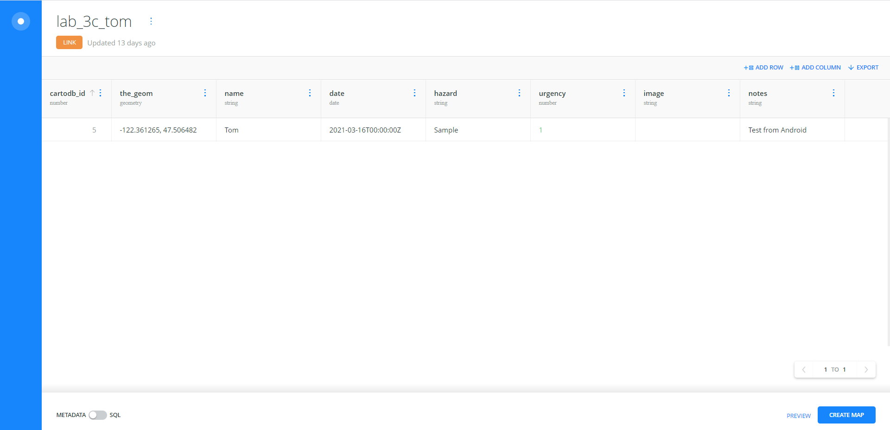
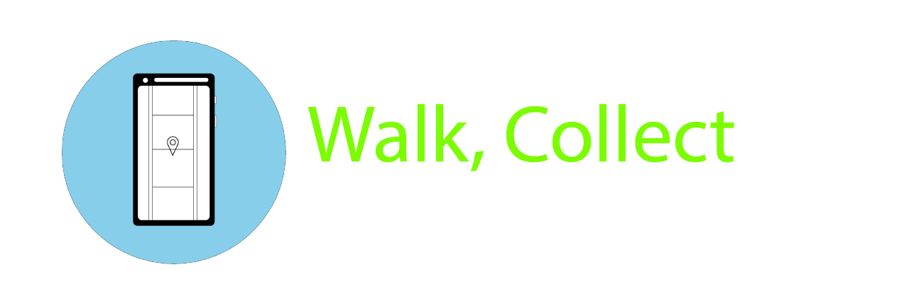
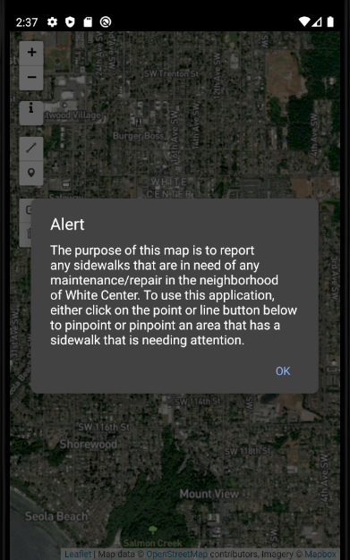
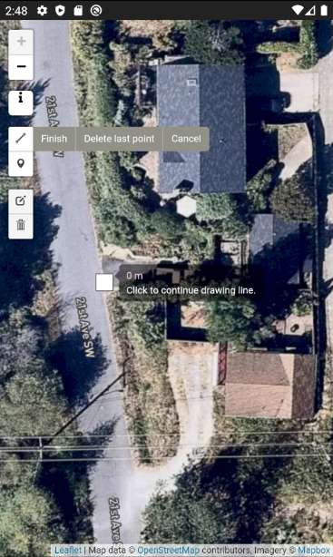
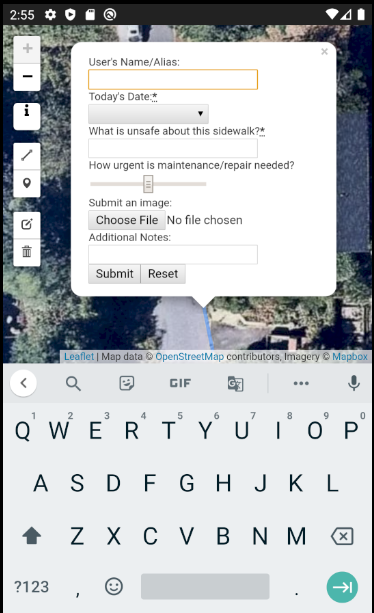
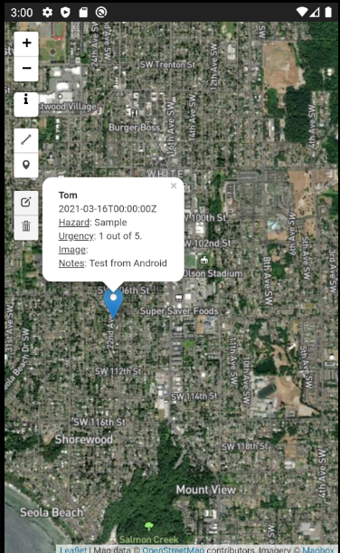

# T GIS 504 - Lab 4: Sidewalk Reporting Data Collector *(Walk, Collect)*
## [DOWNLOAD .APK](app-release-unsigned.apk)

*Screenshot of CARTO Table*
---

**Walk, Collect** is a data collector app that crowdsources reports of any sidewalk maintenance/repair that needs attention, focusing on the neighborhood of White Center.

*The alert window of the application if the information (i) button is clicked*

The app allows for zooming into the satellite map for precise pinpointing of what part of the sidewalk needs attending to. The options for providing location data for the report is either a *point* or *line* of the area that is deemed hazardous or impossible to cross properly.

After plotting either the point or line, the application will collect information for the report. The form will ask for a **name of the reporter**, **the date**, a **description of what makes the sidewalk not safe**, the **urgency of getting the problem fixed on a 1-5 scale**, the option to **upload an image**, and room to provide **additional notes.**

Once the form is submitted, the information will be stored in an external database. The information will also be maintained on the map as a clickable point or line. This allows for the public crowdsource of the sidewalk reporting that is in the need for maintenance or repair.

